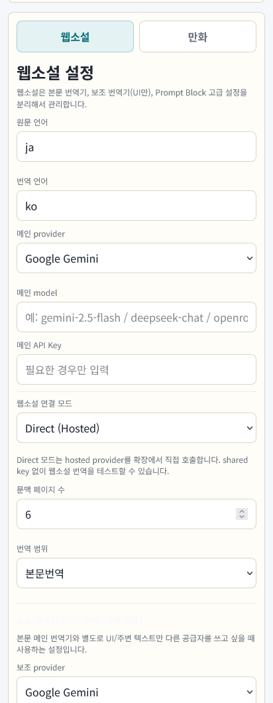
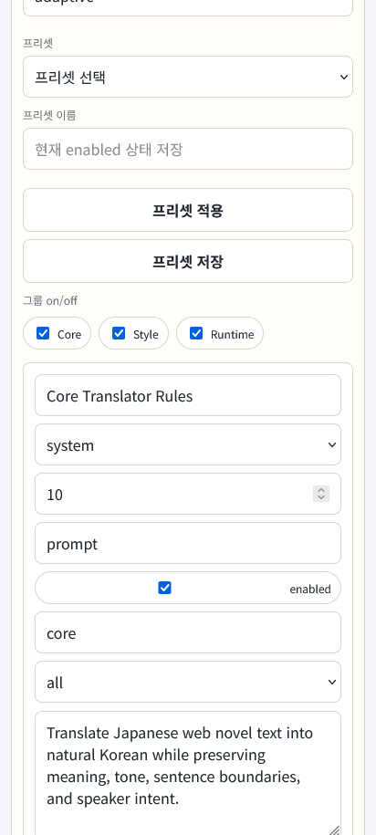
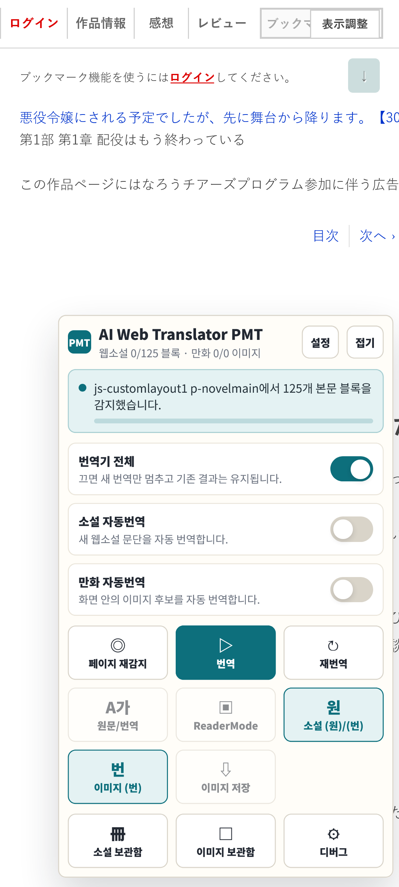
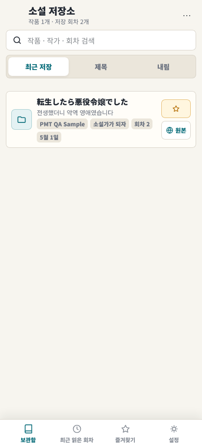
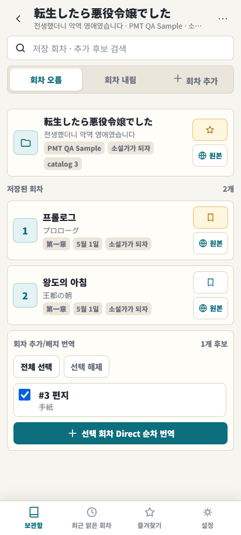
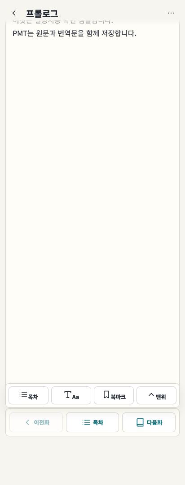
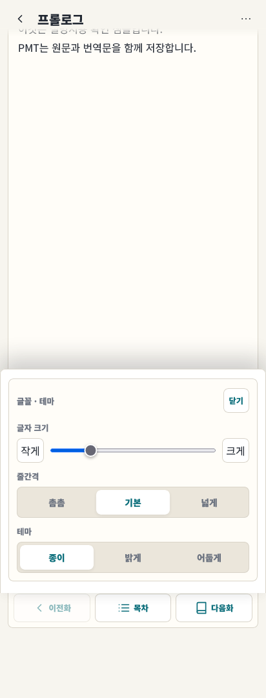
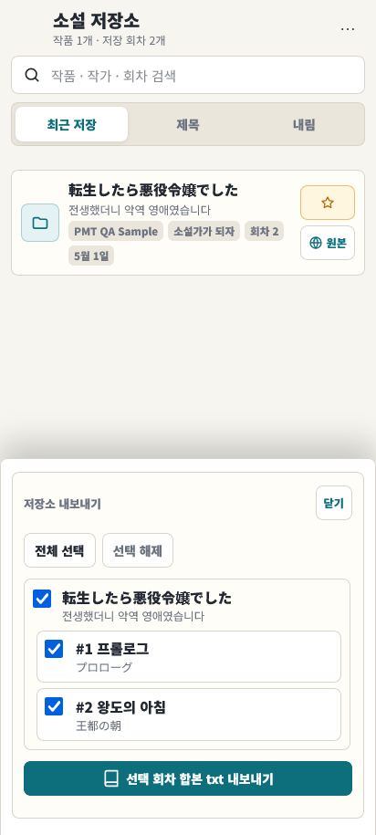

# AI Web Translator PMT 웹소설 사용 설명서

이 문서는 **웹소설 번역 기능**만 설명합니다.  
만화 이미지 번역 기능은 다루지 않습니다.

## 1. 처음 사용하는 순서

가장 먼저 아래 순서대로 설정하면 됩니다.

1. Firefox에 `AI Web Translator PMT` 확장을 설치합니다.
2. 확장 아이콘을 눌러 설정 화면을 엽니다.
3. `웹소설 설정`에서 번역 연결 방식을 고릅니다.
4. 번역 provider와 API key를 입력합니다.
5. 웹소설 페이지를 엽니다.
6. 화면 오른쪽의 `PMT` 버튼을 누릅니다.
7. `페이지 재감지`를 누른 뒤 `번역`을 누릅니다.
8. 번역이 끝나면 `(원)` / `(재)` 버튼이나 `원문/번역` 전환을 사용합니다.
9. 저장된 회차는 `소설 보관함`에서 다시 읽거나 txt로 내보낼 수 있습니다.

처음에는 아래 설정을 권장합니다.

| 항목 | 권장값 |
|---|---|
| 연결 모드 | `Direct (Hosted)` |
| 원문 언어 | `ja` |
| 번역 언어 | `ko` |
| 번역 범위 | `본문번역` |
| 웹소설 자동번역 | 처음에는 꺼짐 |
| Novel only mode | 웹소설만 사용할 경우 켜짐 |

### Firefox Android에 설치하기

PMT를 Android Firefox에서 사용하려면 **서명된 `.xpi` 파일**이 필요합니다.  
배포 페이지에서 받은 signed `.xpi` 파일을 휴대폰에 저장한 뒤 아래 순서로 설치하세요.

1. Android에서 Firefox를 엽니다.
2. 오른쪽 아래 또는 오른쪽 위의 메뉴 버튼을 누릅니다.
3. `설정`을 엽니다.
4. 아래쪽의 `Firefox 정보`로 들어갑니다.
5. Firefox 로고를 빠르게 5번 탭합니다.
6. 숨겨진 메뉴가 열렸다는 안내가 나오면 설정 화면으로 돌아갑니다.
7. `Install Extension from File` 또는 `파일에서 확장 설치`를 누릅니다.
8. 휴대폰에 저장해 둔 PMT signed `.xpi` 파일을 선택합니다.
9. 권한 확인 화면이 나오면 `Add` 또는 `추가`를 누릅니다.
10. 설치가 끝나면 확장 목록에서 `AI Web Translator PMT`를 확인합니다.

공식 Mozilla 안내도 같은 절차를 설명합니다.  
참고: [Mozilla Extension Workshop - Install add-on from file on Android](https://extensionworkshop.com/documentation/publish/install-self-distributed/#install-add-on-from-file-on-android)

일반 공개 확장은 Firefox의 `Add-ons` / `Extensions` 메뉴에서 설치할 수도 있습니다.  
참고: [Mozilla Support - Find and install extensions on Firefox for Android](https://support.mozilla.org/en-US/kb/find-and-install-add-ons-firefox-android)

설치 후에는 확장 설정을 열고 `Direct (Hosted)` 또는 `Local Server` 연결을 설정하면 됩니다.

## 2. 설정 화면



설정 화면에서는 연결 방식, 번역기, API key, 번역 범위, Prompt, 캐시를 관리합니다.

### 2.1 연결 방식 고르기

웹소설은 두 가지 방식으로 번역할 수 있습니다.

| 방식 | 이런 경우에 사용 |
|---|---|
| `Direct (Hosted)` | PC 서버 없이 Gemini, DeepSeek, OpenRouter 같은 외부 번역 provider를 바로 사용할 때 |
| `Local Server` | PC에서 PMT 로컬 서버를 실행하고, 서버를 통해 번역할 때 |

일반 사용자는 먼저 `Direct (Hosted)`를 사용하는 것이 쉽습니다.  
이 경우 provider와 API key만 입력하면 웹소설 번역을 바로 시도할 수 있습니다.

`Local Server`를 사용할 때는 PC에서 PMT 서버를 켜고 아래 값을 맞춰야 합니다.

| 항목 | 설명 |
|---|---|
| 서버 URL | PC에서 실행 중인 PMT 서버 주소 |
| 공유 키(Base64) | 서버와 확장이 함께 쓰는 연결 키 |
| Pairing Token | 서버 연결 인증용 토큰 |

Android Firefox에서 PC 서버를 사용할 경우, 휴대폰에서 PC 주소에 접근할 수 있어야 합니다. 같은 Wi-Fi 또는 Tailscale 같은 연결이 필요합니다.

### 2.2 웹소설 번역기 설정

`웹소설 설정`에서 아래 항목을 설정합니다.

| 항목 | 설명 |
|---|---|
| 원문 언어 | 일본어 웹소설은 보통 `ja` |
| 번역 언어 | 한국어는 `ko` |
| 메인 provider | 본문 번역에 사용할 번역기 |
| 메인 model | 사용할 모델명. 잘 모르겠으면 비워 두거나 기본값 사용 |
| 메인 API Key | provider에서 발급받은 API key |
| 문맥 페이지 수 | 최근 회차 문맥을 얼마나 참고할지 정하는 값 |
| UI 보조 번역기 | 본문이 아닌 짧은 UI/메타 텍스트를 별도 번역기로 처리할 때 사용 |

API key는 다른 사람에게 공유하지 마세요. 배포본이나 스크린샷에 API key가 보이지 않게 주의해야 합니다.

## 3. 번역 범위

웹소설 번역 범위는 세 가지입니다.

| 모드 | 설명 | 추천 상황 |
|---|---|---|
| `본문번역` | 작품 제목, 회차 제목, 본문 중심으로 번역 | 일반 독서용. 가장 권장 |
| `탐색번역` | 본문과 함께 목차, 검색 결과, 회차 목록 같은 탐색용 텍스트도 번역 | 작품 목록이나 검색 페이지를 볼 때 |
| `전체번역` | 화면의 일본어 텍스트를 최대한 넓게 번역 | 필요한 경우에만 사용 |

처음에는 `본문번역`을 사용하세요.  
`전체번역`은 편할 수 있지만, 번역량이 늘어나 비용과 시간이 더 많이 들 수 있습니다.

## 4. Prompt Block



Prompt Block은 번역기의 말투와 규칙을 정하는 기능입니다.

일반 사용자는 기본값 그대로 사용해도 됩니다.  
이름, 말투, 용어 번역을 더 고정하고 싶을 때만 수정하세요.

Prompt Block에서 바꾸는 것은 **번역 지시문**입니다. API key나 서버 연결값을 바꾸는 곳이 아닙니다.

### 4.1 언제 수정하면 좋은가

아래 같은 문제가 반복될 때 Prompt Block을 수정하면 효과가 있습니다.

| 상황 | 넣으면 좋은 규칙 |
|---|---|
| 인물 이름이 회차마다 다르게 번역됨 | 이름 표기를 고정 |
| 말투가 갑자기 존댓말/반말로 바뀜 | 캐릭터별 말투 규칙 추가 |
| 판타지/게임 용어가 흔들림 | 용어집 형태로 번역어 지정 |
| 문장이 요약되거나 빠짐 | 문단 순서와 정보 누락 금지 규칙 추가 |
| 대사 부호가 어색함 | 따옴표, 말줄임표, 감탄 표현 유지 규칙 추가 |

예를 들어 이런 내용을 추가할 수 있습니다.

| 원하는 효과 | Prompt에 적을 수 있는 내용 |
|---|---|
| 인명 고정 | `主人公 이름은 항상 "유우토"로 번역한다.` |
| 말투 유지 | `존댓말과 반말의 차이를 유지한다.` |
| 용어 고정 | `魔力은 "마력"으로 번역한다.` |
| 문단 유지 | `원문의 문단 순서를 바꾸지 않는다.` |

### 4.2 블록 항목 설명

Prompt Block을 펼치면 각 블록에 여러 입력칸이 보입니다.

| 항목 | 설명 | 처음 쓸 때 권장 |
|---|---|---|
| Block name | 내가 알아보기 쉬운 블록 이름 | `이름/용어집`, `문체 규칙`처럼 작성 |
| role | 번역기에게 전달되는 메시지 역할 | 대부분 `system` 사용 |
| priority | 적용 순서. 숫자가 낮을수록 먼저 들어감 | 잘 모르겠으면 기본값 유지 |
| type | 블록 종류 메모 | 보통 `prompt` 유지 |
| enabled | 해당 블록 사용 여부 | 잠깐 비교할 때만 끄기 |
| groupId | 여러 블록을 한 그룹으로 묶는 이름 | 처음에는 비워도 됨 |
| modeScope | 특정 Prompt 모드에서만 쓰는 범위 | 처음에는 `all` 유지 |
| Prompt content | 실제 규칙을 적는 칸 | 짧고 명확하게 작성 |

`role`은 대부분 `system`으로 두면 됩니다.  
`user`와 `assistant`는 예시 대화처럼 특수한 구성을 만들 때만 사용하세요.

### 4.3 좋은 Prompt 작성법

Prompt는 길게 쓰는 것보다 **고정하고 싶은 규칙을 짧고 분명하게** 쓰는 편이 좋습니다.

좋은 예:

```text
인명:
- ルナ = 루나
- カイト = 카이토

용어:
- 魔力 = 마력
- 冒険者ギルド = 모험가 길드

문체:
- 대사는 자연스러운 한국어 구어체로 번역한다.
- 원문에 없는 설명을 덧붙이지 않는다.
- 문단 순서를 유지한다.
```

피하는 것이 좋은 예:

```text
무조건 엄청 잘 번역해줘.
모든 걸 자연스럽게 알아서 고쳐줘.
내용이 어색하면 적당히 요약해줘.
```

특히 “요약해줘”, “줄여줘” 같은 지시는 웹소설 본문 누락으로 이어질 수 있으니 넣지 않는 것이 좋습니다.

Prompt 화면에서 할 수 있는 일:

- Prompt 블록 켜기/끄기
- 새 규칙 추가
- 기존 규칙 수정
- 프리셋 저장
- Prompt 설정 내보내기/가져오기
- 번역 요청 미리보기 확인

### 4.4 Prompt 설정 내보내기/가져오기

`내보내기`는 현재 Prompt Block과 일부 번역 설정을 JSON 파일로 저장합니다.  
`가져오기`는 저장해 둔 Prompt 설정 JSON을 다시 불러옵니다.

이 기능은 아래 상황에서 유용합니다.

- 다른 기기에서도 같은 이름/용어 규칙을 쓰고 싶을 때
- 작품별 Prompt 세트를 따로 보관하고 싶을 때
- Prompt를 크게 수정하기 전에 백업하고 싶을 때
- 번역 설정을 다른 사람에게 공유하고 싶을 때

Prompt 설정 파일에는 API key가 포함되지 않습니다.  
가져온 뒤에도 API key는 본인 설정 화면에서 따로 입력해야 합니다.

### 4.5 Provider request patch JSON

`Provider request patch JSON`은 Prompt 문장이 아니라, 번역 provider로 보내는 **요청 옵션**을 조정하는 고급 기능입니다.

일반 사용자는 비워 두는 것을 권장합니다.  
번역 온도, 최대 출력 토큰 같은 provider 옵션을 직접 조절하고 싶을 때만 사용하세요.

JSON 입력 규칙:

- 반드시 `{ ... }` 형태의 JSON object여야 합니다.
- 문자열은 큰따옴표 `"`를 써야 합니다.
- 주석을 넣을 수 없습니다.
- 마지막 항목 뒤에 쉼표를 붙이면 안 됩니다.
- 잘못된 JSON을 넣으면 설정 저장이나 미리보기가 실패할 수 있습니다.

Gemini에서 번역을 조금 더 안정적으로 만들고 싶을 때:

```json
{
  "generationConfig": {
    "temperature": 0.4,
    "maxOutputTokens": 8192
  }
}
```

Gemini는 아래처럼 밑줄 형태로 적어도 내부에서 같은 의미로 처리합니다.

```json
{
  "generation_config": {
    "temperature": 0.4,
    "max_output_tokens": 8192
  }
}
```

DeepSeek / OpenRouter 같은 OpenAI 호환 provider에서는 `passthrough` 안에 옵션을 넣는 방식이 안전합니다.

```json
{
  "passthrough": {
    "temperature": 0.4,
    "max_tokens": 8192
  }
}
```

자주 쓰는 값:

| 값 | 의미 | 권장 방향 |
|---|---|---|
| `temperature` | 번역 표현의 자유도 | 낮을수록 안정적, 높을수록 다양함 |
| `maxOutputTokens` | Gemini 최대 출력 길이 | 긴 회차에서 부족할 때 증가 |
| `max_tokens` | OpenAI 호환 provider 최대 출력 길이 | 긴 회차에서 부족할 때 증가 |
| `topP` / `top_p` | 후보 단어 선택 범위 | 잘 모르면 건드리지 않기 |

처음 조정할 때는 `temperature`만 바꿔 보세요.  
값을 너무 많이 한 번에 바꾸면 어떤 설정 때문에 결과가 달라졌는지 알기 어렵습니다.

번역 결과가 이상해졌다면 최근에 추가한 Prompt를 끄고 다시 번역해 보세요.

## 5. 웹소설 페이지에서 번역하기



웹소설 페이지를 열면 화면 오른쪽에 `PMT` 버튼이 나타납니다.  
이 버튼을 누르면 현재 페이지 조작 패널이 열립니다.

자주 쓰는 버튼은 아래와 같습니다.

| 버튼 | 기능 |
|---|---|
| `페이지 재감지` | 현재 페이지에서 번역할 본문을 다시 찾습니다. |
| `번역` | 감지된 문단을 번역합니다. |
| `재번역` | 기존 번역 결과를 무시하고 다시 번역합니다. |
| `원문/번역` | 원문 보기와 번역 보기 사이를 전환합니다. |
| `ReaderMode` | 지원 사이트에서 PMT 전용 읽기 화면으로 들어갑니다. |
| `소설 (원)/(번)` | 문단 옆 원문/재번역 버튼 표시를 켜고 끕니다. |
| `소설 보관함` | 저장된 웹소설 보관함을 엽니다. |

기본 사용 흐름:

1. 웹소설 본문 페이지를 엽니다.
2. 오른쪽 `PMT` 버튼을 누릅니다.
3. `페이지 재감지`를 누릅니다.
4. 본문 블록 수가 잡히면 `번역`을 누릅니다.
5. 번역이 마음에 들지 않는 문단은 `(재)`로 다시 번역합니다.
6. 원문을 보고 싶으면 `(원)`을 누릅니다.

## 6. 원문 보기와 재번역

번역된 문단 옆에는 상황에 따라 `(원)` 또는 `(재)` 버튼이 표시됩니다.

| 버튼 | 기능 |
|---|---|
| `(원)` | 해당 문단의 원문을 봅니다. |
| `(번)` | 다시 번역문 보기로 돌아갑니다. |
| `(재)` | 해당 문단만 다시 번역합니다. |

페이지 전체를 다시 번역하고 싶으면 플로팅 패널의 `재번역`을 사용하세요.

## 7. ReaderMode

ReaderMode는 웹소설을 더 읽기 쉬운 화면으로 바꿔 주는 기능입니다.

주요 기능:

- 본문 중심 읽기 화면
- 이전화 / 목차 / 다음화 이동
- 원문/번역 전환
- 읽기 중 설정 패널 열기
- 일반 페이지로 돌아가기
- 저장소와 이어지는 회차 읽기 흐름

사용 방법:

1. 지원되는 웹소설 페이지를 엽니다.
2. 오른쪽 `PMT` 버튼을 누릅니다.
3. `ReaderMode`를 누릅니다.
4. 본문을 읽습니다.
5. 화면을 탭하면 상단/하단 조작부를 숨기거나 다시 볼 수 있습니다.
6. 읽기를 끝낼 때는 ReaderMode 해제 버튼으로 원래 페이지로 돌아갑니다.

ReaderMode는 주로 아래 사이트에서 사용합니다.

| 사이트 | 예시 |
|---|---|
| 소설가가 되자 | `ncode.syosetu.com` |
| 하멜른 | `syosetu.org` |
| Pixiv Novel | `pixiv.net/novel` |

로그인이 필요한 작품은 Firefox에서 먼저 해당 사이트에 로그인한 뒤 사용하세요.

## 8. 소설 보관함



번역한 웹소설은 소설 보관함에 저장됩니다.  
나중에 같은 회차를 다시 찾거나, 저장된 번역본만 따로 읽을 때 사용합니다.

소설 보관함에서 할 수 있는 일:

- 저장된 작품 보기
- 작품 검색
- 최근 읽은 회차 확인
- 즐겨찾기 작품 모아 보기
- 작품별 회차 목록 열기
- 저장된 회차 읽기
- 저장된 회차를 txt 파일로 내보내기

하단 탭:

| 탭 | 기능 |
|---|---|
| `보관함` | 저장된 작품 목록 |
| `최근 읽은 회차` | 최근에 열었던 회차 |
| `즐겨찾기` | 즐겨찾기한 작품 |
| `설정` | 보관함 관련 설정 |

## 9. 작품 폴더와 회차 추가



작품을 누르면 작품 폴더가 열립니다.

작품 폴더에서는 저장된 회차와 아직 저장하지 않은 회차를 함께 볼 수 있습니다.

주요 기능:

| 기능 | 설명 |
|---|---|
| 저장 회차 읽기 | 이미 번역해 저장한 회차를 엽니다. |
| 원본 열기 | 원래 웹소설 페이지를 새 탭으로 엽니다. |
| 회차 북마크 | 중요한 회차를 표시합니다. |
| 미저장 회차 추가 | 목차에서 찾은 회차를 선택해 번역 후 저장합니다. |
| 진행률 표시 | 여러 회차를 추가할 때 현재 진행 상태를 보여줍니다. |

여러 회차를 한 번에 추가하려면 API key와 네트워크 상태가 안정적이어야 합니다.  
중간에 취소하면 완료된 회차만 저장됩니다.

## 10. 저장소 리더



저장소 리더는 저장된 회차를 읽는 화면입니다.

화면 구성:

| 위치 | 기능 |
|---|---|
| 상단 | 뒤로가기, 회차 제목, 더보기 |
| 본문 | 번역문 또는 원문 표시 |
| 하단 | 목차, 글자 설정, 북마크, 맨위 |
| 본문 끝 | 이전화 / 목차 / 다음화 이동 |

본문을 탭하면 상단/하단 조작부를 숨기거나 다시 볼 수 있습니다.  
긴 회차를 읽을 때는 조작부를 숨기면 화면을 더 넓게 쓸 수 있습니다.

## 11. 글자 크기와 테마



저장소 리더에서 `Aa` 버튼을 누르면 읽기 화면을 조절할 수 있습니다.

| 설정 | 설명 |
|---|---|
| 글자 크기 | 본문 글자 크기를 조절합니다. |
| 줄간격 | 문단 사이와 줄 사이 간격을 조절합니다. |
| 테마 | 종이 / 밝게 / 어둡게 중 선택합니다. |
| 기본 읽기 모드 | 회차를 열 때 번역문을 먼저 볼지, 원문을 먼저 볼지 정합니다. |

눈이 피로하면 `종이` 테마나 `어둡게` 테마를 사용해 보세요.

## 12. txt로 내보내기



저장된 회차는 txt 파일로 내보낼 수 있습니다.

사용 방법:

1. `소설 보관함`을 엽니다.
2. 내보내기 화면을 엽니다.
3. 내보낼 작품이나 회차를 체크합니다.
4. `합본 txt 저장`을 누릅니다.
5. 저장 완료 메시지를 확인합니다.

내보내기는 작품별 합본 txt를 만듭니다.  
여러 회차를 선택하면 회차 순서대로 묶입니다.

Android Firefox에서는 저장 위치가 브라우저 다운로드 설정을 따릅니다. 저장이 보이지 않으면 Firefox 다운로드 목록을 먼저 확인하세요.

## 13. 캐시와 저장소 관리

PMT에는 `캐시`와 `소설 보관함`이 따로 있습니다.

| 구분 | 설명 |
|---|---|
| 캐시 | 같은 문단을 다시 번역할 때 속도를 높이기 위한 임시 데이터 |
| 소설 보관함 | 사용자가 다시 읽을 수 있도록 저장된 작품/회차 데이터 |

`소설 캐시 지우기`를 해도 보관함의 작품이 바로 삭제되는 것은 아닙니다.  
저장된 작품이나 회차를 지우려면 소설 보관함의 삭제 기능을 사용하세요.

캐시를 지우면 좋은 경우:

- 예전 번역 결과가 계속 다시 나올 때
- Prompt를 크게 바꿨는데 결과가 바뀌지 않는 것처럼 보일 때
- provider나 모델을 바꾼 뒤 새 결과로 다시 받고 싶을 때
- 오류가 반복되어 깨끗한 상태에서 다시 시도하고 싶을 때

## 14. 지원 사이트

웹소설 기능은 일반적인 일본어 본문 페이지에서도 동작할 수 있지만, 아래 사이트를 우선 지원합니다.

| 사이트 | 주요 기능 |
|---|---|
| 소설가가 되자 계열 | 본문 번역, 목차, 검색 결과, ReaderMode, 저장소 |
| 하멜른 | 본문 번역, 목차, ReaderMode, 저장소 |
| Pixiv Novel | 본문 번역, 시리즈/본문 읽기, 저장소 |

Pixiv의 이미지 작품 페이지는 웹소설 기능이 아니라 만화/이미지 번역 기능에 해당합니다.

## 15. 자주 생기는 문제

### PMT 버튼이 보이지 않음

- 페이지를 새로고침합니다.
- 확장이 켜져 있는지 확인합니다.
- Firefox에서 해당 사이트에 확장 권한이 허용되어 있는지 확인합니다.
- 웹소설 페이지가 아닌 검색/광고/로그인 화면인지 확인합니다.

### 본문 블록 수가 0개로 나옴

- `페이지 재감지`를 다시 누릅니다.
- 본문이 완전히 로딩될 때까지 기다립니다.
- 로그인이 필요한 작품이면 먼저 로그인합니다.
- `탐색번역` 또는 `전체번역`으로 범위를 바꿔 봅니다.

### 번역이 시작되지 않음

- API key가 입력되어 있는지 확인합니다.
- provider와 model 설정이 맞는지 확인합니다.
- `번역기 켜기/끄기`가 켜져 있는지 확인합니다.
- Local Server 모드라면 PC 서버가 실행 중인지 확인합니다.
- 휴대폰에서 PC 서버 주소에 접속 가능한지 확인합니다.

### 번역 결과가 이상함

- `(재)`로 해당 문단만 다시 번역합니다.
- 페이지 전체는 `재번역`을 누릅니다.
- 최근에 추가한 Prompt Block을 끄고 다시 시도합니다.
- 번역 범위를 `본문번역`으로 낮춰 봅니다.

### 저장소에 회차가 보이지 않음

- 번역이 끝난 뒤 잠시 기다립니다.
- `소설 보관함`을 닫았다가 다시 엽니다.
- 원본 페이지가 지원 사이트인지 확인합니다.
- 로그인 전용 작품은 로그인 상태에서 다시 번역합니다.

### txt 저장 파일을 찾을 수 없음

- Firefox 다운로드 목록을 확인합니다.
- Android의 `Downloads` 폴더를 확인합니다.
- 저장 실패 메시지가 떴다면 회차 수를 줄여 다시 시도합니다.

## 16. 추천 사용 패턴

처음 읽는 작품:

1. 원본 사이트에서 1화를 엽니다.
2. `PMT` → `페이지 재감지` → `번역`을 누릅니다.
3. 번역 품질이 괜찮으면 ReaderMode로 읽습니다.
4. 마음에 드는 작품은 보관함에서 즐겨찾기합니다.

여러 회차를 이어서 읽기:

1. 작품 목차 또는 저장소 작품 폴더를 엽니다.
2. 필요한 회차를 추가 번역합니다.
3. 저장소 리더에서 이전화/다음화로 이동합니다.
4. 읽기 설정에서 글자 크기와 테마를 맞춥니다.

번역 품질을 다듬기:

1. 자주 틀리는 이름과 용어를 Prompt Block에 추가합니다.
2. 해당 회차를 `재번역`합니다.
3. 마음에 들지 않는 문단만 `(재)`로 다시 번역합니다.
